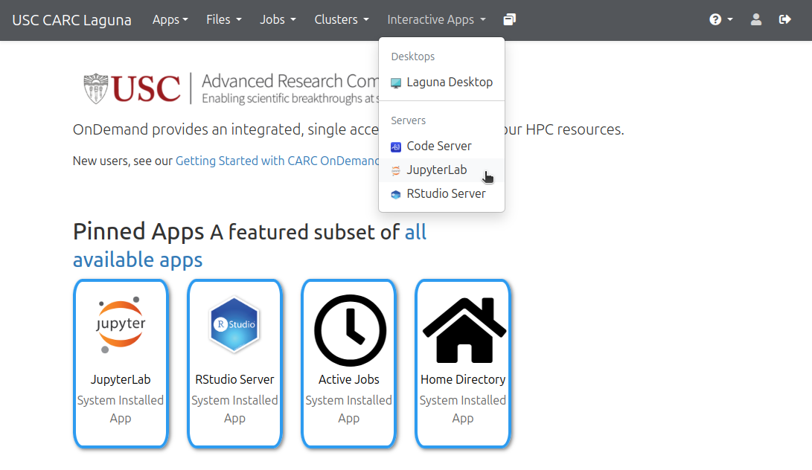
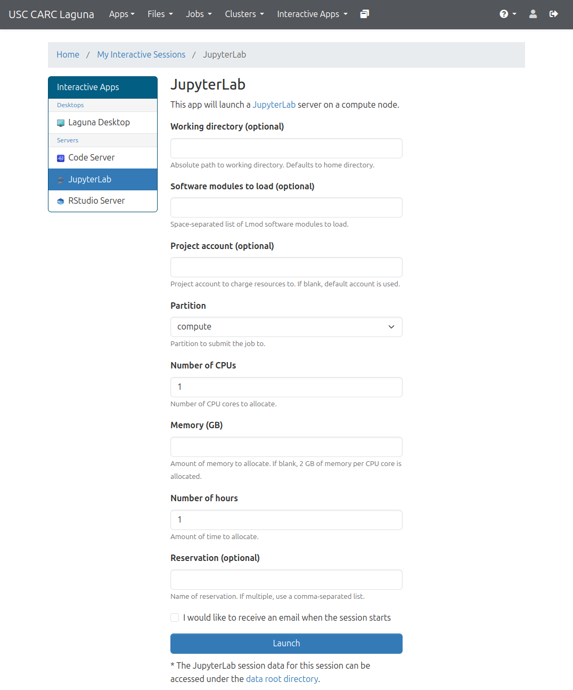
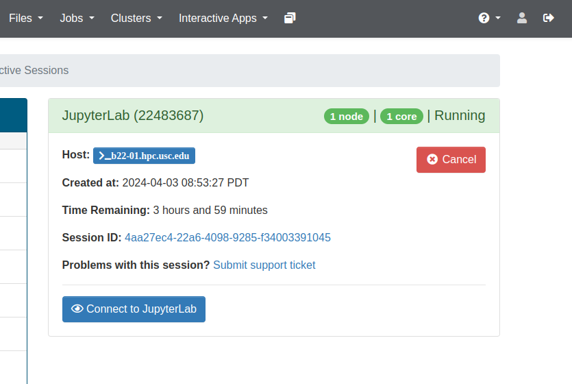
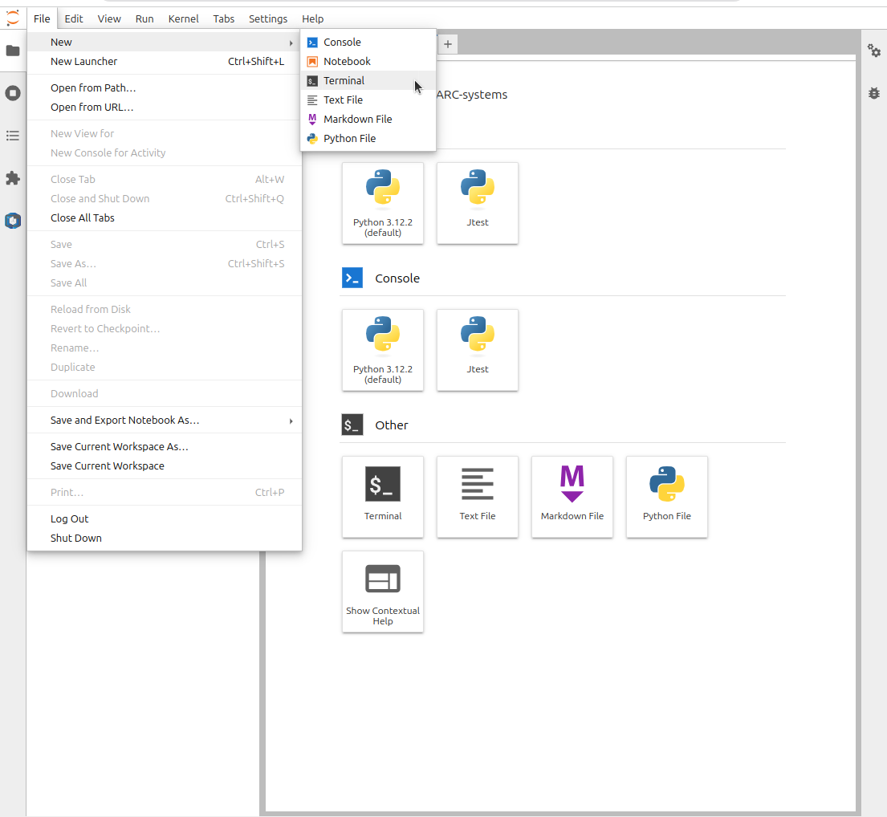

[](https://carc.usc.edu)
[](https://uschpc.github.io/regional-computing-website)
# Running jobs on CARC Laguna - Workshop

This repository contains preconfigured slurm job script examples, to run on USC CARC Laguna Cluster. 

## By participating in this workshop, you’ll:

* Learn the fundamental skills and tools required to run jobs on CARC Laguna Cluster

* Gain experience with different job types and submission file structure

* Take a brief look into troubleshooting your jobs

* Build confidence to create your own jobs

#### Duration: 1.5 hours
#### Prerequisites: An understanding of fundamental CARC Laguna Cluster setup and CARC Laguna Ondemand.
#### Suggested materials to satisfy prerequisites:
* [Gettting started with CARC Laguna](https://uschpc.github.io/regional-computing-website/user-guides/get-started-laguna.html)

* [Laguna Ondemand](https://uschpc.github.io/regional-computing-website/user-guides/get-started-laguna/laguna-ondemand.html)


#### Hardware Requirements: Desktop or laptop computer capable of running any modern web browser. 

#### Language: English

## Getting Started
To get started, use a web browser and log on to CARC Laguna OnDemand Instance at [https://laguna-ood.carc.usc.edu](https://laguna-ood.carc.usc.edu) . You need to use your InCommon credentials to log in (your institution email in most cases). 

To start a Jupyter notebook server, Click on Interactive Apps and then select JupyterLab.



When launching the Jupyter Lab, it is important to select the following
* For Account, specify the account you normally use, like `ttrojan_123`
* For Partition, specify compute
* Set the number of CPUs to 2
* Set Memory to 2GB
* Set the number of hours to 4

For the Laguna workshop, please do the above with the following change:
* For Account (Laguna workshop), specify `hpcsuppt_613` if you have been added to the training project. Otherwise use the project on Laguna you belong to.


The above settings are important to ensure you start a JupyterLab Server on a node that is located on the Discovery cluster and has slurm management engine installed and configured



Once your JupyterLab Session starts, Click Connect to JupyterLab button



From there, Click on File -> New and then click on Terminal to get the terminal



Once in the terminal, clone this GitHub Repository

```
module load laguna git
git clone https://github.com/uschpc/running-jobs-on-CARC-laguna.git
```

In Jupyter, navigate to the example you are interested in, and step through the notebook. 

For first-time users, we highly recommend to do the notebooks in order, as they build up on concepts in the previous notebooks.

